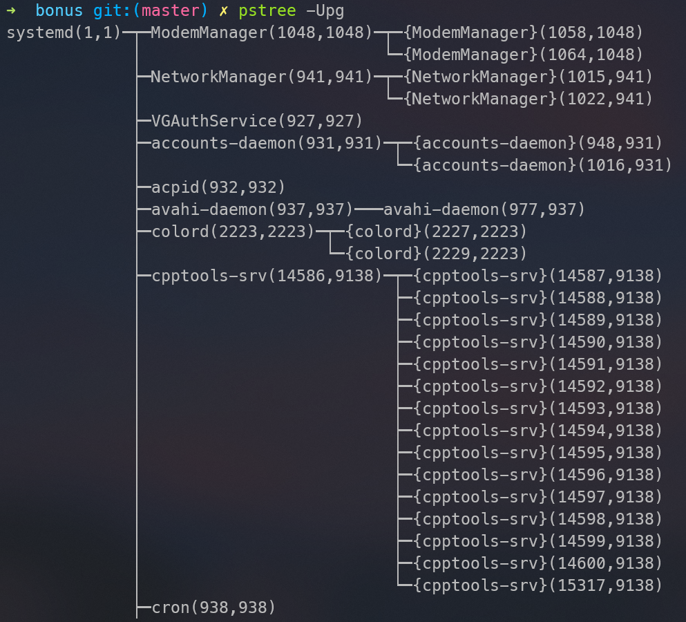

# CSC3150 Assignment 1

Xi Mao (119020038)

## Problem 1
### How did I design the program
This solution is straightforward and is similar to tutorial contents. I use `fork()` to create a child process, where I use `execve()` to execute a custom program. Then, in parent process, use `wait()` to wait for child process finishing execution and print out the (interpreted) exit status.  

### How to test my program
Firstly, compile everything by `make all`  

To test executing one program,
```shell
make test tgt=<program name>
```  

To test all programs,
```shell
make testall
``` 

### Sample output
**Note:** The outputs here were not exactly the same as program running outputs, because I edited program outputs to match demo outputs in assignment description.  

Case: child process raises signal: SIGSTOP


All cases


### What did I learn
- How to create a child process and execute a program in child process in c.
- How to wait for a child process to finish execution and get its exit status.

## Problem 2
### How did I design the program
The general approach is similar to problem 1, but more complicated. In `program2_init`, I create a kernel thread that runs `my_fork`, where `kernel_clone` is called to fork a child process. The child process will then run `my_exec` to run custom program (`/tmp/test`). The parent process will run `my_wait` to wait for child process finishing execution and print out the (interpreted) exit status.

### Set up dev environment and compile kernel
1. Download kernel source code from [www.kernel.org](https://www.kernel.org/). I use `5.10.146`.
2. Use apt to install required packages as described in tutorial 2.
3. Export function `kernel_clone` `getname_kernel` `do_wait` `do_execve` to allow using them in kernel module
4. Run `make menuconfig` to configure kernel. Then run `make` to compile kernel.
5. Run `sudo make modules_install` to install kernel modules and `sudo make install` to install kernel.

### How to test my program
Firstly, use `make` to compile the kernel module and test program.  
Then, you can either insert and remove the kernel in shell manually, or use `make run` to do it automatically.

You can run `make testall` to test user programs with different exit signals at once.

### Sample output
Sample output of `make testall`


### What did I learn
- How to compile (and modify) linux kernel and kernel module
- How to write, insert, and remove a kernel module
- How to functions that runs in kernel space
- (Very important) With insufficient guidance given, how to search information from web, learn important staffs, and solve problems.

## Bonus Problem
### How did I design the program
This problem is much, much, more complicated (which I think worths way more than 10 points). The general steps are:
1. Parse command line arguments.
2. Scan `/proc` directory and get process information from `/proc/<pid>/status`.
3. Optionally, scan `/proc/<pid>/task` directory and get thread information from `/proc/<pid>/task/<tid>/status`.
4. Each process/thread is represented by a `struct proc_node` object, which stores information like pid, ppid, pgid, name, flag, etc. A linked list is used to store all processes/threads.
5. Loop through the linked list to add parent-child relationship and build process trees. A process's children are stored in a linked list of `struct child_node`, which contains a pointer to `struct proc_node` and a pointer to the next child.
6. Select the root process to print according to the command line arguments. If no root process is specified, choose the process with pid 1 as root. Then, fix orphan processes by adding them as children of the root process.
7. Optionally, if compact mode is specified, trim the process tree by combining same children into one node.
8. Print the process tree recursively.

### How to use the program
Firstly, use `make` to compile the program. The binary is located at `build/pstree`.
Then, you can use `build/pstree [PID] [args]` to run the program.
- `PID`: the root process to print. If not specified, the process with pid 1 will be used.
- `args`, the following 5 parameters are implemented:
  - `-c`: disable compact mode. Do not combine same children into one node.
  - `-p`: print process id.
  - `-g`: print process group id.
  - `-T`: ignore threads.
  - `-U`: print using Unicode characters.

### Sample output
- vanilla


- `-U` use Unicode characters


- specify root process


- `-c` disable compact mode


- `-T` ignore threads


- `-p` print pid


- `-g` print pgid


### What did I learn
- One way to access process status in linux (via /proc/...)
- How to read process stat and parse a process tree in c
- Write a relatively complex c program