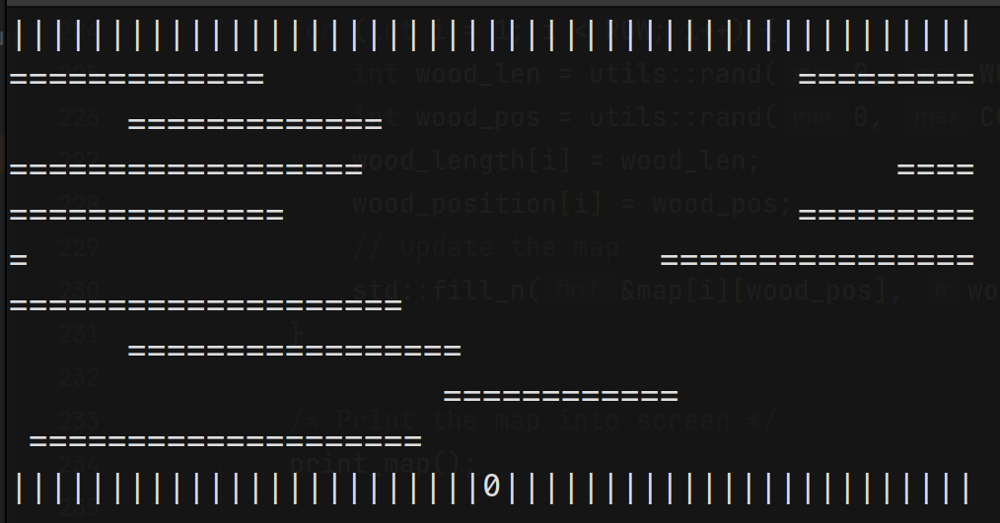
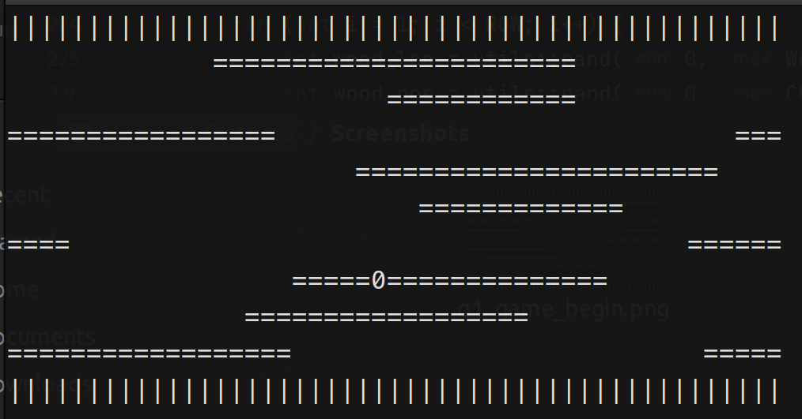
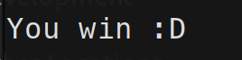
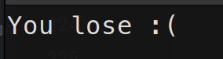
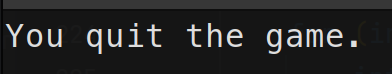

# CSC3150 Assignment 2 - Report

Mao Xi (119020038)

## Development Environments

The development was done under the following environment:

- Ubuntu 22.04 LTS
- Linux kernel version: 6.0.1
- GCC version: 11.2.0

Tested under:

- Ubuntu 20.04 LTS
- Linux kernel version: 5.15.0

## Q1: Frog Game

### How did I design my program

The program first initializes the map with top and bottom banks, a frog, and an empty river. Then, it add logs to each row with an integer length randomly chosen from [`LOG_LEN_BASE`, `LOG_LEN_BASE + LOG_LEN_VAR`]. The remaining work is decomposed into the following tasks:

1. Logs movement
2. User input handling and frog movement
3. Screen rendering

#### Logs movement

N `log_move_thread`  (N is the number of rows representing river), each controlling one row, are created to perform log movement. Every `FRAME_INTERVAL` microseconds, odd indexed logs move one step left and evened indexed logs move one step right. The movement is implemented by erasing the last `=` and drawing a new `=`  one step ahead at movement direction, and move the frog if necessary. Macro `ACTUAL_INDEX` is used to calculate the valid index to deal with cross-boundary movement.  After each movement, `update_game_status`() is called to determine whether the player losses (in this case, the frog stays on the log and goes out of left or right boarder).

#### Input handling and frog movement

The thread `frog_ctrl_thread` is created to handle user input and perform frog movement using an infinite loop. In each iteration, if a key-hit event is detected using the provided `kbhit()` function, the thread will check whether the entered key is a valid input (one of w, a, s, d, q). If the player enters `q`, quit immediately. If key represents a valid movement, it will be performed by adjusting `0` 's position. Then, `update_game_status()` is called to determine whether the player losses.

#### Screen rendering

The thread `screen_render_thread` 's only task is to refresh the screen (i.e. clear the old output and re-print the map) repeatedly with interval `FRAME_INTERVAL` (in microseconds).

`game_mutex`, `frog_mutex`, and `map_mutex` are used to regulate threads' access to game status, frog's position, and map, respectively. All thread will end when the player wins, losses, or quits the game. Then, a message will be printed to indicate the game status.

### How to execute the program

1. Choose an appropriate terminal (as far as I know, CLion's integrated terminal and macOS's built-in terminal don't work) and `cd` to `source` directory
2. Build the program using `make all`
3. Run the program using `make run` or `./hw2`

**Playing guidance**:

- Use w, a, s, d to move up, left, down, right, respectively
- In this game, when the frog is on bank, you cannot move it out of the world (e.g. pressing `s` at the start at the game will have no effect)

### Sample outputs

- Start Game

- Game in progress

- Win

- Lose

- Quit

### What did I learn

- How to design a console GUI program
- How to use `pthread` to do multi-thread programming
- How to use `mutex` to control multi threads' access on the same resource

## Q2: Thread Pool

### How did I design my program

The thread pool `my_queue_t` contains an array of threads (workers) and a linked list of `my_task_t`, which encapsulates a function pointer and it's parameters. During initialization, the thread pool uses `pthread_create` to create `num_thread` threads and an empty task list. Each thread will run the same function `worker_start` containing a `while true` loop, where the worker checks if there are submitted tasks in the task list. If there are, the worker will repeat to get and do a task until all tasks are finished. Then, the worker will suspend by calling `pthread_cond_wait` to wait for the `start` signal, which is issued when a new task is added to the task list.

The task list is a singly linked list. Task execution respects FIFO order -- the head of the list will be processed first, and a new task will be added to the tail of the list. A mutex is used to control threads' access to the task list.

### How to execute the program

1. Build the program using `make all`
2. Start the `httpserver` with appropriate command line arguments

### Sample outputs

Not applicable for this program.

### What did I learn

- The code structure of a thread pool
- How to use `pthread_cond_wait` and `pthread_cond_signal` to suspend and wake up threads under certain conditions
- How to create a task list and dynamically assign tasks to idle threads
