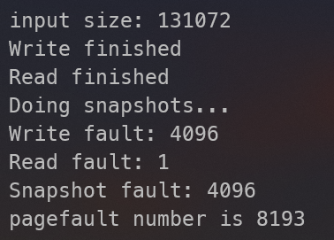
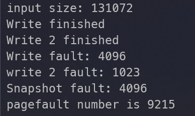
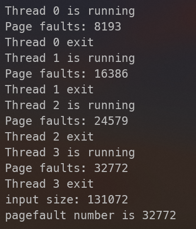

# CSC3150 Assignment 3 Report

Mao Xi (119020038)

## Main Program

### 1. Environment Settings

#### Develop

- OS: Windows 11 22H2 Build 22623.875
- GPU: Nvidia GeForce RTX3070Ti
- IDE: Visual Studio 2022 Community 17.3.6
- CUDA: 11.8
- Compiler: MSVC v143 and nvcc 11.8

#### Test

Tested on the HPC with the following environment:

- OS: CENTOS-7

- GPU: Nvidia Quadro RTX 4000
- CUDA: 11.7
- Compiler: g++ 4.8.5 and nvcc 11.7

### 2. Execution Steps

1. `cd` into the root directory of source code
2. Run `sbatch ./slurm.sh`, which contains a command to build: `nvcc --relocatable-device-code=true -arch=sm_75 -std=c++11 main.cu user_program.cu virtual_memory.cu -o test` and a command to run: `srun ./test`

Parameters' meaning:

- `-arch=sm_75`: Generate device code for Nvidia Quadro RTX 4000's architecture
- `-std=c++11`: Use C++ 11 standard 

### 3. Program Design

#### Important Configurations

The assignment has configurations:

- Physical memory (GPU shared memory) size: 32KB
- "Disk" (GPU global memory) size: 128KB
- Page size: 32B
- Page table size: 16KB
- Supported virtual memory size: 32KB + 128KB = 160KB

Therefore, after some calculation, we have the following information:

- Page offset: 5 bits
- Physical Page Number (**PPN**): 10 bits
- Virtual Page Number (**VPN**): 13 bits (which allows addressing 256KB virtual memory)
- Physical memory can contain 1024 pages
- "Disk" can contain 4096 pages

#### General Design

The program uses inverted page table, where indices are PPNs and the values are page table entries (**PTE**s) containing VPNs. When there's an access to virtual address `vaddr`, the program will first try to search the page table to find a PTE with matching VPN and return the corresponding PPN (i.e. index of that PTE). If the search fails, the program will look at total number of pages (`vm->entry_num` in code) written to memory. If physical memory is not full, the program will throw an error for read operations and create a new page in memory for write operations. Otherwise, the program searches the "disk" and swaps with LRU policy.

#### Page Table Design

A page table entry consists the following sections:

- Bit 31: Valid bit. 1 - valid, 0 - invalid
- Bit 29~19: The PPN of next entry of the LRU list
- Bit 18~13: Unused
- Bit 12~0: The corresponding VPN

The LRU policy is implemented by a singly linked list embedded in PTEs. The list starts from the most recently used (MRU) PTE and ends with the least recently used (LRU) PTE. Every valid PTE node contains a pointer (bit 19~29) to next PTE in the LRU list, and the last PTE's pointer points `0x3FF`. Struct `VirtualMemory` `vm` holds three fields, `vm->mru`, `vm->lru`, `vm->lru2` that are index of the first, last, and second last PTE of the list, respectively.


When a VPN is accessed (read/write), the residing PTE will be placed to the head of the list and becomes the new MRU node.

In this way, my page table only requires 1024 * 4B = 4KB memory space to run.

#### Swap Table Design

Array `vm->swap_table` maintains the mapping from VPN to the address in "disk" where the corresponding page is stored. Additionally, a array bitmap (`vm->storage_bitmap`) is used to denote whether each page in "disk" is occupied. Both arrays are stored in "disk".

A swap consists of three steps:

1. Find a victim page in memory by the LRU policy and copy its content to a temporary page buffer `vm->swap_buffer`.
2. Find where the page with desired VPN (target page) is stored in "disk" from the swap table and copy the page to the memory address where the victim page resides in. Update the VPN of the PTE in page table to the VPN of the target page.  
3. Search through `vm->storage_bitmap` to find an empty page in "disk" to store the victim page and copy the victim page from temporary page buffer to "disk".

The temporary page buffer `vm->swap_buffer` enables swapping even if both physical memory and "disk" are full (i.e. we used all 160KB virtual memory). 

### 4. Sample Output

User Program 1 (Test Case 1)



User Program 2 (Test Case 2)



### 5. Page Fault Number

Page fault numbers increases when:

1. Writing to unused memory pages during initial `vm_write`
2. The desired page cannot be found in memory and a **swap** is performed

Below are explanations of outputs of user program 1 and 2:

#### User Program 1

As the output figure shows, the page fault number can be decomposed into $4096+1+4096$

1. Write 128KB (4x memory size, 4096 pages) of data to originally empty memory, which will trigger 4096 page faults

   ```c++
   input_size = 128 * 1024  // 128KB
   for (int i = 0; i < input_size; i++) {
       vm_write(vm, i, input[i]);
   }
   ```

   

2. Read 32KB + 1B of data in reversed order. After step 1, the first 32KB of data is already in memory to read, but the last 1 bit of data (i.e. `i = input_size - 32769`) will trigger a page fault.

   ```c++
   for (int i = input_size - 1; i >= input_size - 32769; i--) {
       vm_read(vm, i);
   }
   ```

3. Read 128KB of data in increasing address order (`vm_snapshot`). Since the memory now contains pages with the highest memory addresses, every reading to a new page will trigger a page fault, resulting in 4096 page faults.

   ```c++
   vm_snapshot(vm, results, 0, input_size);
   ```

#### User Program 2

The number can be decomposed into $4096+1023+4096$, the explanation is similar to the first program.

1. Write 128KB of data (with address range: `[32K, 160K)`) to empty memory, resulting in 4096 page faults

   ```c++
   // write the data.bin to the VM starting from address 32*1024 [32K, 160K]
   for (int i = 0; i < input_size; i++)
       vm_write(vm, 32 * 1024 + i, input[i]);
   ```

2. Write 32KB - 32B of data (with address range: `[0, 32K-32)`), which will result in 1023 swaps

   ```c++
   // write (32KB-32B) data to the VM starting from 0 [0, 32KB-32B]
   for (int i = 0; i < 32 * 1023; i++)
       vm_write(vm, i, input[i + 32 * 1024]);
   ```

3. Read 128KB of data from memory starting from 32K in increasing address order. Since the memory now contains 1023 pages with the lowest address and a page with the highest address, every read operation to a new page will cause a page fault, resulting 4096 page faults.

   ```c++
   // readout VM[32K, 160K] and output to snapshot.bin, which should be the same with data.bin
   vm_snapshot(vm, results, 32 * 1024, input_size);
   ```

### 6. Problems Encountered and Things Learned

Problems:

1. Not familiar with CUDA programming
2. Bugs in implementing the LRU list and the swap table

Solutions:

1. Refer to tutorial notes and Nvidia CUDA development guides to learn important concepts of CUDA programming
2. Set up CUDA development environment locally and use Visual Studio's powerful debugger to execute step by step, inspect variables' values, and examine device memory view to help me debug.

Things Learned:

1. Basic knowledges of CUDA programming
2. How to design and implement an inverted page table

## Bonus

### 1. Environment and Execution Steps

Same as the main program.

### 2. Program Design

#### Multi-threads Page Table Design

I use version 2 with physical memory size = 32KB and "disk" storage size = 128KB. There is a variable `vm->current_tid` indicting which thread is operating. When a new thread is scheduled to run and `vm->current_tid` is not equal to its thread id, it will clear the page table and the swap table first.

#### Thread Scheduling

I use non-preemptive scheduling to schedule 4 threads. Specifically, the thread with smallest thread id (`threadIdx.x`) will run first, so that the running order is: `thread 0 -> thread 1 -> thread 2 -> thread -> 3`. The order is ensured by an CUDA atomic lock:

```c++
struct Lock {
    int* mutex;
    Lock() {
        int state = 0;
        cudaMalloc(&mutex, sizeof(int));
        cudaMemcpy(mutex, &state, sizeof(int), cudaMemcpyHostToDevice);
    }
    ~Lock() { cudaFree(mutex); }
    
    __device__ void lock(unsigned int compare) {
        while (atomicCAS(mutex, compare, 0xFFFFFFFF) != compare) {}
    }
    __device__ void unlock(const unsigned int val) { atomicExch(mutex, val + 1); }
};
```

All threads run the following code snippet:

```c++
thread_lock.lock(threadIdx.x);
// user program the access pattern for testing paging
user_program(&vm, input, results, input_size);
thread_lock.unlock(threadIdx.x);
```

The lock can only be acquired by the thread with `thread id == *mutex`, so that at any given time, one thread is running and other threads are waiting to acquire the lock. `*mutex` is initially set to 0 and increments by one after an `unlock` operation, allowing threads 0, 1, 2, 3 to acquire lock and execute the user program one by one.

### 3. Sample Output

User Program 1 (Test Case 1)



### 4. Page Fault Number

Total page fault number is `8193 * 4 = 32772`. The result is obvious: I implement version 2, where a thread cleans all contents written by other threads, so that the out is equivalent to running single thread program for four times and sum up page fault numbers.

### 5. Problems Encountered and Things Learned

Problem: 

- How to schedule CUDA threads

Solution:

- Search through Nvidia developement guides and Stack Overflow, finding that I can use an atomic lock to create a critical section in CUDA device code

Things learned:

- CUDA atomic operations
- How to implement and use an atomic lock